<div align="center">

  <!-- Animated Vector SVG Header -->
  <a href="https://github.com/Mateo-Piedra22">
    
  </a>

  <br /><br />

  <!-- Animated Typing Subtitle -->
  <p align="center">
    <a href="https://github.com/Mateo-Piedra22">
      
    </a>
  </p>

  <!-- Metric Badges Row -->
  <p align="center">
    <a href="https://github.com/Mateo-Piedra22"></a>
    &nbsp;
    <a href="https://motiona.xyz"></a>
    &nbsp;
    <a href="mailto:piedrabuena.mateo03@gmail.com"></a>
    &nbsp;
    
  </p>

</div>

---

## Executive Profile & Systems Architecture Focus

I am a **Computer Engineering student** at the **National University of the Littoral (UNL)** in Santa Fe, Argentina, and a **Systems & Full-Stack Architect**. My engineering centers on high-reliability distributed engines, native hardware communication layers, offline-first cashier runtimes, developer control planes, and low-latency desktop applications.

```
+-----------------------------------------------------------------------------------------------+
|  ACADEMIC DISCIPLINE    : Computer Engineering (Ingenieria en Informatica)                    |
|  INSTITUTION            : Universidad Nacional del Litoral (UNL), Santa Fe, Argentina         |
|  FLAGSHIP SYSTEMS       : ArgenPOS (Enterprise POS & Hardware Bridge) · Cline Marketplace    |
|  VENTURE & STUDIO       : MotionA Studio (https://motiona.xyz)                                |
|  CORE SPECIALIZATION    : Hardware Protocols · IPC · Local-First Engines · AI Control Planes  |
+-----------------------------------------------------------------------------------------------+
```

---

## Flagship Systems Showcase

<br />

### 1. [ArgenPOS & ArgenPOS Bridge](https://github.com/Mateo-Piedra22/argenpos-bridge-releases) — *Enterprise Commercial POS & Native Hardware Bridge*

**ArgenPOS** is a high-availability Point of Sale and retail transaction platform engineered for commercial retail chains, supermarkets, and hospitality environments requiring continuous transaction processing and millisecond-level hardware execution.

#### Hardware Interfacing & IPC Protocol Topology

```
+------------------------------------+                             +----------------------------------------+
|         ArgenPOS Web Client        |    Local Loopback WebSocket |          ArgenPOS Native Bridge        |
|      (React / TypeScript POS)      | <=========================> |     (Self-Contained Windows Service)   |
|   - Real-time Cashier Terminal     |     ws://127.0.0.1:9876     |   - Token-Authenticated IPC Protocol   |
|   - Offline Queue & Reconciliation |                             |   - Low-Level COM Serial Multiplexer   |
+------------------------------------+                             +-------------------+--------------------+
                                                                                       |
                         +-----------------------------+-------------------------------+------------------------------+
                         |                             |                               |                              |
                         v                             v                               v                              v
             +-----------------------+     +-----------------------+       +-----------------------+      +-----------------------+
             |   Thermal Printers    |     |     Cash Drawers      |       |   Customer Displays   |      |  Barcode & Scales     |
             |   (ESC/POS via COM)   |     |   (Pin 2 Kick Pulse)  |       |   (VFD 2x20 Pole Display)    |  (RS-232 Serial Port) |
             |   - Raw Raster Bitmap |     |   - Automated Solenoid|       |   - Real-time Price Line  |      |  - Continuous Weight  |
             |   - Sub-10ms Cut Fire |     |   - Drawer State Probe|       |   - Scrolling Promotional |      |  - Tare / Zero Events |
             +-----------------------+     +-----------------------+       +-----------------------+      +-----------------------+
```

#### Technical Layer Specifications

| Architecture Layer | Core Implementation Details |
| :--- | :--- |
| **Native Daemon** | Windows background service distributed as a standalone `.exe` without Node or runtime dependencies. |
| **Hardware Driver Engine** | Raw bitstream ESC/POS generation with bitmap conversion, codepage mapping, and cut command queuing. |
| **Serial Bus Multiplexer** | Concurrent non-blocking polling across COM1–COM16 serial ports for scanners and digital weighing scales. |
| **Offline Transaction Buffer**| Local transactional append-only log with deterministic conflict resolution upon cloud reconnection. |
| **Security Layer** | Local loopback isolation (`127.0.0.1`), shared cryptographic tokens, and zero outbound telemetry exposure. |

<p align="left">
  <a href="https://github.com/Mateo-Piedra22/argenpos-bridge-releases"></a>
  &nbsp;
  
</p>

---

### 2. [Cline Marketplace](https://github.com/Mateo-Piedra22/ClineMarket) — *Local Control Plane & Primitive Registry for Cline*

**Cline Marketplace** is a developer-grade local control plane, offline-first registry browser, and CLI runner for Cline plugins, skills, and Model Context Protocol (MCP) servers.

```
+--------------------------------------------------------------------------------------------------------------------+
|                                              CLINE MARKETPLACE SYSTEM                                              |
+--------------------------------------------------------------------------------------------------------------------+
|   [ FRONTEND CONTROL PLANE ]            [ RECONCILIATION ENGINE ]              [ WORKSPACE HEURISTICS ]            |
|   - Vanilla ESM Design System           - Multi-root Filesystem Probing        - package.json / pyproject AST      |
|   - Multi-token Inverted Index          - Ghost / Drift Detection Engine       - Curated Toolchain Synthesizer     |
|   - Dynamic Port Auto-Allocation        - Atomic JSON State Persistence        - Project-scoped Installation Scope |
+--------------------------------------------------------------------------------------------------------------------+
```

| Component | Technical Capabilities |
| :--- | :--- |
| **Reconciliation Engine** | Probes active VS Code, Claude Desktop, and Cline CLI configuration paths to dynamically reconcile live disk state against catalog definitions. |
| **Scoped Installation** | Supports scoped primitive execution targeting isolated project workspaces (`--scope workspace`) with persistent workspace history. |
| **Verification Pipeline**| Headless Chrome DevTools Protocol (CDP) automated screenshot capture hook and full cross-platform CI matrix testing on every push. |

<p align="left">
  <a href="https://github.com/Mateo-Piedra22/ClineMarket"></a>
  &nbsp;
  
</p>

---

### 3. [Discord Archive Pro](https://github.com/Mateo-Piedra22/Discord-Archive-Pro) & [IronTrain](https://github.com/Mateo-Piedra22/IronTrain)

<table>
  <tr>
    <td width="50%" valign="top">
      <h3 align="center"><a href="https://github.com/Mateo-Piedra22/Discord-Archive-Pro">Discord Archive Pro</a></h3>
      <p align="center">
        
        
      </p>
      <p>High-fidelity desktop application engineered for cold archival, indexing, and offline browsing of complete Discord communities, voice logs, threads, and multi-gigabyte media attachments with full-text search indexing.</p>
    </td>
    <td width="50%" valign="top">
      <h3 align="center"><a href="https://github.com/Mateo-Piedra22/IronTrain">IronTrain & IronHub</a></h3>
      <p align="center">
        
        
      </p>
      <p>Cross-platform fitness analytics and training progression system featuring dynamic periodization calculators, set-by-set velocity tracking, and distributed community workout logging.</p>
    </td>
  </tr>
</table>

---

## Technical Skills & Systems Matrix

<div align="center">
  
  <br />
  
</div>

<br />

| Technical Domain | Technologies, Protocols & Toolchains |
| :--- | :--- |
| **Low-Level & Hardware** | `C / C++` `Serial Ports (RS-232 / COM)` `ESC/POS Thermal Protocol` `Windows Service Daemons` `Child Process IPC` |
| **Runtimes & Backends** | `Node.js (v18–v22+)` `TypeScript` `Express.js` `Fastify` `WebSockets (ws)` `RESTful Architectures` `CDP Protocol` |
| **Frontend & Desktop** | `React` `Next.js` `Electron` `Vite` `Tailwind CSS` `Vanilla ES Modules` `Design Systems` `HTML5 / CSS3 (CSS Grid)` |
| **Databases & Storage** | `PostgreSQL` `SQLite (WAL Mode & FTS5)` `Redis` `Atomic JSON File Engines` `Prisma ORM` |
| **DevOps & Infrastructure** | `Docker` `GitHub Actions (CI/CD Matrices)` `Cloudflare Workers` `Linux (Debian/Ubuntu)` `Git & GitHub CLI` |
| **AI Agents & MCP** | `Model Context Protocol (MCP)` `Cline Agent Ecosystem` `Anthropic Claude API` `Local LLM Integration (Ollama)` |

---

## Live Performance & Activity Telemetry

<div align="center">
  
</div>

---

## Contribution Graph & Continuous Activity

<picture>
  <source media="(prefers-color-scheme: dark)" srcset="https://raw.githubusercontent.com/Mateo-Piedra22/Mateo-Piedra22/output/github-contribution-grid-snake-dark.svg">
  <source media="(prefers-color-scheme: light)" srcset="https://raw.githubusercontent.com/Mateo-Piedra22/Mateo-Piedra22/output/github-contribution-grid-snake.svg">
  
</picture>

---

## Contact & Professional Inquiries

<div align="center">
  <a href="https://github.com/Mateo-Piedra22">
    
  </a>
  &nbsp;
  <a href="https://motiona.xyz">
    
  </a>
  &nbsp;
  <a href="mailto:piedrabuena.mateo03@gmail.com">
    
  </a>
</div>

<br />

<div align="center">
  
</div>
